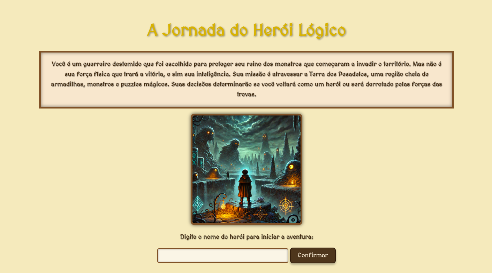
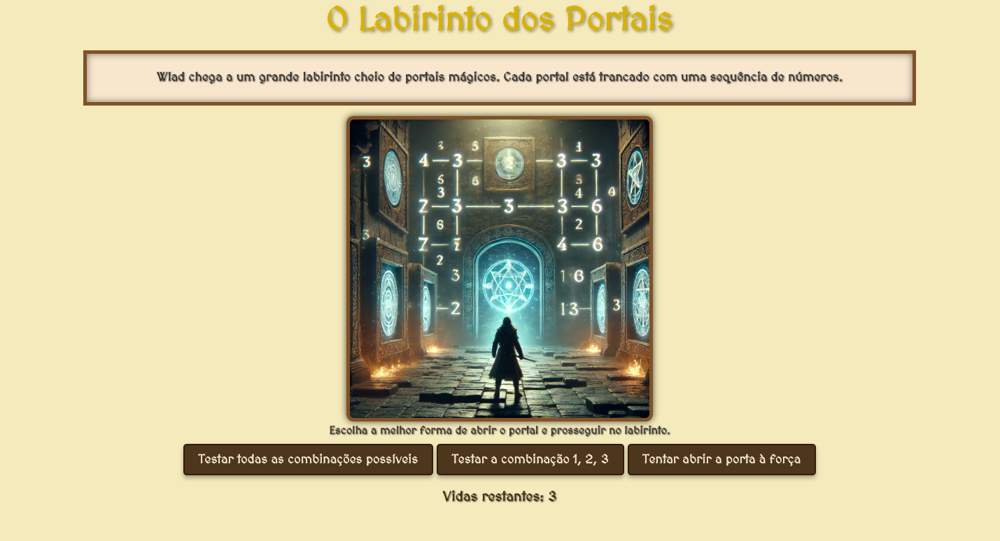

# A Jornada do Herói Lógico

**A Jornada do Herói Lógico** é um projeto de educação gamificada que combina uma aventura interativa com conceitos de programação. O jogo conta a história de um herói que enfrenta uma série de desafios e deve usar seu conhecimento lógico para tomar decisões corretas e avançar na história. Durante sua jornada, o herói precisa resolver problemas que envolvem lógica, recursão, algoritmos e funções.

## Funcionalidades

- **História Interativa**: O jogador acompanha o herói em uma aventura que exige habilidades de resolução de problemas e tomadas de decisão.
- **Conceitos de Programação**: Cada desafio apresentado na história está relacionado a conceitos de programação, como recursões, condições if/else, algoritmos e funções.
- **Sistema de Vidas**: O herói tem 3 vidas. Decisões erradas podem custar vidas, mas o jogador pode avançar e aprender com os erros.
- **Finais Dinâmicos**: Dependendo das escolhas e das vidas restantes, o jogador pode alcançar diferentes finais, como o Final Heróico, Final Neutro ou Final de Derrota.

## Como Jogar

1. O jogador inicia o jogo dando um nome ao herói.
2. Ao longo da aventura, o herói enfrenta diferentes cenários, cada um com opções de decisão baseadas em conceitos de programação.
3. O jogador deve selecionar as melhores respostas para avançar e evitar a perda de vidas.
4. O jogo pode ser reiniciado a qualquer momento ao completar o ciclo da história ou perder todas as vidas.

## Link para Experimentar

Os interessados podem experimentar a aplicação diretamente através deste link:  
[https://a-jornada-do-heroi-logico.vercel.app/](https://a-jornada-do-heroi-logico.vercel.app/)

## Tecnologias Utilizadas

- **HTML**: Estrutura do jogo e conteúdo das páginas.
- **CSS**: Estilização do jogo, com temática medieval e responsividade.
- **JavaScript**: Lógica de jogo, controle de fluxo da história e tomadas de decisão.
- **Vercel**: Hospedagem da aplicação.

## Prints do Jogo

1. **Tela de Início**:  
   

2. **Cenário de Desafio**:  
   
